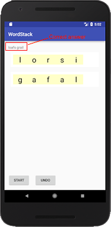

# Word Stack

This program creates a the game of Word Stack. In this game, player is first given two empty boxes that will hold letters.

One letter is given at a time, and player needs to decide where to put the letter, so that in the end there will be two five-letter words that make sense.

When player finishes the last letter, the correct answer appears at the top.

This program is part of the [Google Applied CS with Android Workshop](https://appliedcsskills.withgoogle.com/unit?unit=10&lesson=12). Please check the website for detailed instructions on how to implement this program.

